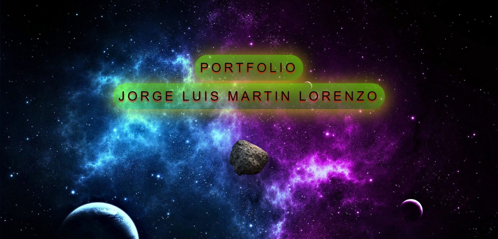
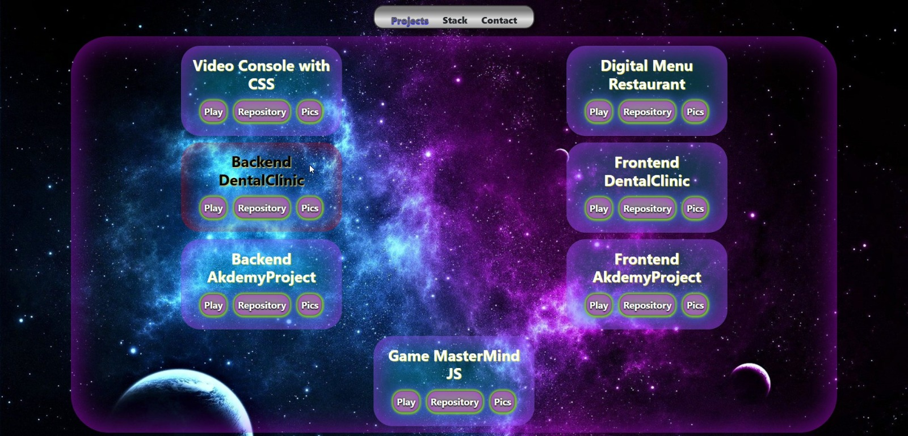
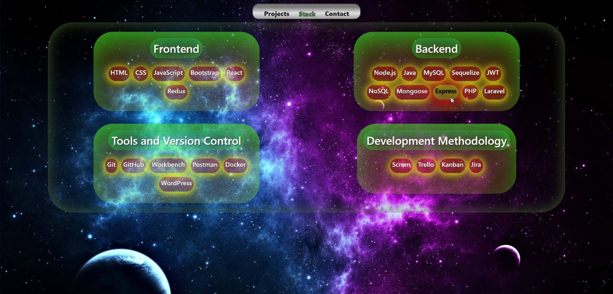
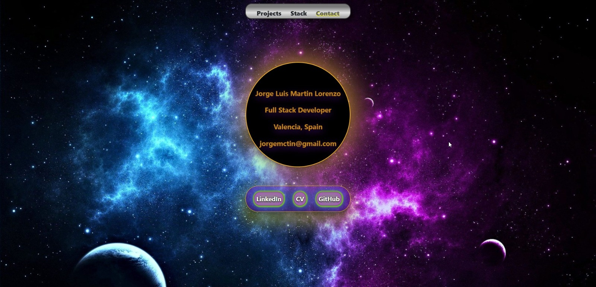

## Portfolio - Jorge Luis Martin Lorenzo

[PLAY](https://portfolio-jlml.vercel.app/)

#### Página de Inicio 
En la página de inicio, encontrarán mi nombre junto a un asteroide girando en el espacio.

#### Página de Proyectos 
En la página de proyectos, se puede explorar mis creaciones presentadas en forma de 'nebulosa'.

#### Página de Stack 
Mi Stack tecnológico (por ahora), lenguajes de programación, herramientas y frameworks, que utilizo para crear.

#### Página de Contacto 
En el cual figurarán algunos datos y enlaces a mis redes en caso de que deseen ponerse en contacto conmigo.

#### Licencia y Copyright:
Se ha obtenido el ícono y el background de las siguientes páginas:

www.iconfinder.com
https://thptnganamst.edu.vn

#### Autor:
Jorge Luis Martin Lorenzo.